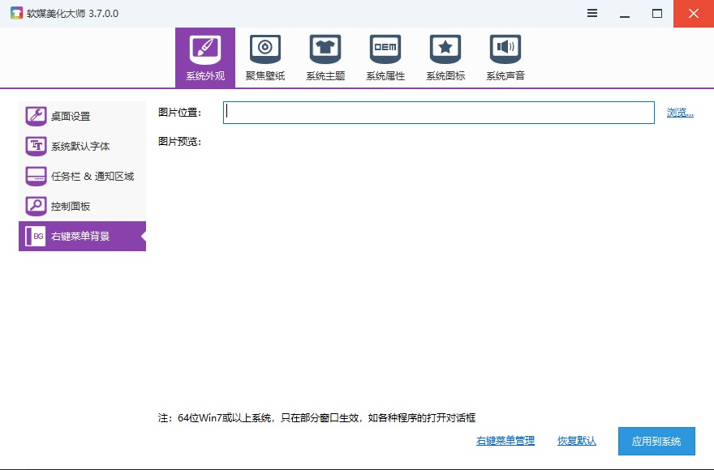

# 一、使用主题包修改系统右键菜单背景图（Win XP/7）

1. 网上搜索下载安装Windows主题包或者主题修改软件

2. 选择已经修改了右键菜单背景的桌面主题，下载后应用生效即可;

# 二、使用工具更改右键菜单背景（Win XP/7）

1. 网上搜索下载安装软媒魔方，打开软媒魔方，点美化桌面;

2. 选择右键菜单背景，点浏览，选择图片，点打开;

3. 点应用到系统。

# Win10 1703/1709/1803 使用Dism++开启右键菜单背景

!> 此教程仅适用于包含右键菜单皮肤的Win10主题，没有包含的话是无效的！  
仅兼容Win10 1703/1709/1803，不兼容更高版本！  
【警告：dism++里的其他功能，请不要随意修改！】

运行dism++，在控制面板里选择系统优化，找到windows7体验，选择“将右键菜单调整为win7模式”，按提示重启explorer或者注销即可。

若你的主题内没有右键菜单背景图片，则安装dism++也不会显示。

> Win10开启右键菜单背景 引用地址：https://zhutix.com/study/win10-menu-background/