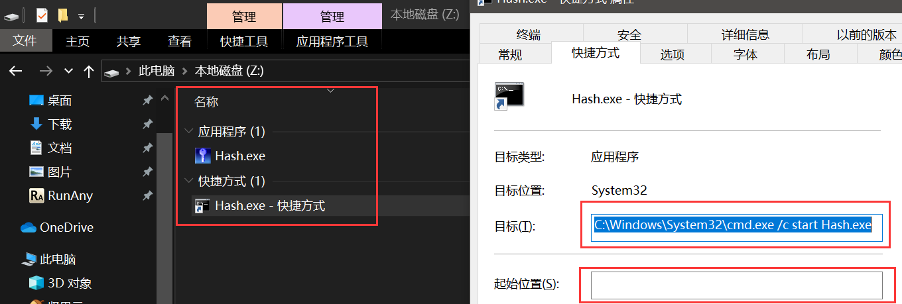

## 无路径如何区别运行重名的exe程序

**RunAny的特色功能就是可以一劳永逸地运行不同电脑上不同路径的应用程序**

在使用过程发现有很多软件升级后依旧保留了老版本的exe文件，比如WPS，比如Scoop这类软件库中的软件

那为了避免出现RunAny运行到老版本或不正确的重名exe程序，有以下办法：

### 一、升级RunAny版本到5.6.9版本以上，自动优先最新版本exe程序功能【推荐⭐⭐⭐】

?> 在RunAny 5.6.9版本以上，在RunAny设置的Everything设置中增加了`搜索结果优先最新版本同名exe全路径`的选项  
所以打开此选项后就完美支持了Scoop这类软件库中的软件，无路径也能自动定位到最新版本的EXE程序

---

### 二、创建bat、vbs、ahk、无路径cmd命令快捷方式等中转，在RunAny中添加使用这个不重名可执行文件【推荐⭐⭐】

（快捷方式的运行方式设为最小化可以隐藏掉cmd运行的黑框）  

?> 建议放在目标软件同一目录下，脚本命令代码不要带路径，或者使用相对路径  
随软件在不同电脑、网盘、U盘同步变更目录后依然可用，加在RunAny中可以无路径定位便捷运行  
还可以做到一次运行多个、命令传递参数等功能

---

### 三、修改RunAny设置中的Everything搜索参数，屏蔽不正确路径程序【推荐⭐⭐】

解决了高低版本的exe程序识别，那还有相同版本或者不正确的exe怎么屏蔽不让RunAny错误运行呢

比如Wiz.exe的路径有  
1. `D:\Program Files (x86)\WizNote\Wiz.exe`
2. `D:\Users\Documents\My Knowledge\Update_x86\Wiz.exe`

code.exe的路径有  
1. `D:\scoop\apps\vscode\1.40.2\Code.exe`
2. `D:\Program Files\Ruby26-x64\msys64\usr\libexec\code.exe`

我们可以发现两个Wiz.exe是相同版本exe，两个code.exe实际是完全不同的软件  
因为系统中规定相同文件夹不存在同名exe，所以可以用感叹号`!`来屏蔽掉指定的exe，如上面应该设置
`!*\Update_x86\Wiz.exe !*\libexec\code.exe`  
这样就可以屏蔽掉第2个重名或不正确的路径exe程序，同时RunAny默认是已经屏蔽掉Windows系统缓存和回收站文件`!C:\Windows* !?:\$RECYCLE.BIN*`

> 通配符: `*` 匹配 0 个或多个字符  `?` 匹配 1 个字符.

---

### 四、菜单变量路径运行，系统环境变量、网盘路径、AHK内置变量等（升级RunAny版本到5.7.0版本以上）【推荐⭐】

如根据OneDrvie网盘路径运行应用：`PortableApps|%OneDrive%\Start.exe`

相对于RunAny安装路径的应用：`Notepad2|%A_ScriptDir%\..\..\..\Apps\Zz\TotalCMD64\Tools\Notepad2.exe`

---

### 五、全路径指定运行，只推荐固定路径安装程序，不推荐绿色软件使用此方式

如：`IE(32位)|C:\Program Files (x86)\Internet Explorer\iexplore.exe`

**每台电脑的软件安装都固定为C盘或D盘Program Files的exe程序可以使用此方式解决重名问题**  

!> 不推荐绿色软件使用，因为经常会移动位置导致RunAny会定位到按字母排序的最后盘符和目录的exe程序，可能运行到其他同名exe，
而且经常修改配置也就达不到“一劳永逸”的效果
