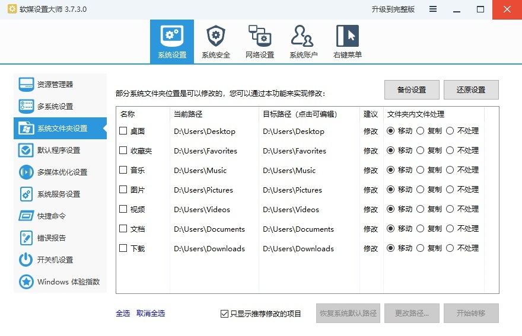

# 如何实现软件环境一劳永逸

相信各位都经历过**重装系统**的痛苦，无论是系统卡顿、报错、空间不够……

总有一个原因导致你不得不重装系统😑

而重装后最头疼、最费时间的是：

**自己熟悉的所有软件和配置全没了，得从头开始**

想要还原到重装前非常的麻烦，甚至还可能会丢失忘记一些软件和文件。

**那有没有那种 一次配置好，重装后简单几步操作就基本恢复成 重装前 的办法呢？**

答案是：**只要“一劳”足够通用合理，“逸用”的时间就会非常长久**

---

## 一、转移系统常用文件夹从C盘到D盘上

推荐使用`软媒设置大师winmaster.exe`绿色单文件

可以把桌面、下载、图片、音乐、视频、我的文档、IE收藏夹等转移到D盘

这样不仅重装后数据一点不会丢，而且重新再用软媒设置大师设置D盘文件夹路径，原来的文件就全部回来了

  关注公众号回复：设置大师 或者 winmaster获取软件

---

## 二、软件使用优先级： 软件包管理平台 > 绿色版本 > 安装版本

软件包管理平台集合了下载、安装、更新、卸载等功能，只要把默认软件目录设置在D盘，软件配置文件也会在D盘

这样重装系统后重新配置一下软件包管理平台，即可马上使用重装前所有软件，而且软件配置跟原来一模一样！

推荐软件包管理平台：

1. PortableApps（图形化界面，软件便携绿色化）https://portableapps.com/
2. Scoop（功能更多、第三方库丰富）https://scoop.sh/

80%的软件可以在软件包管理平台找到，另外10%的软件可搜索找到绿色版本

剩下没有绿色版本需要安装的软件已经不多，只有国内的一些常用软件

如QQ（配置在我的文档）、安全管家之类软件（配置保不保留不重要）

这类软件用软件管家或者去官网下载最新版安装一遍就可以了

> 一般在安装时，建议把安装路径从`C:\Program Files\` 改为 `D:\Program Files\`

## 三、利用RunAny还原重装前的软件使用方式

RunAny是一款仅需要保存程序名就可以自动定位运行的快捷启动工具

平时把所有软件包平台中的软件、绿色软件通通分类放进RunAny后，**这就是你的软件清单**

完全丢掉记忆负担，想处理图片直接去图像软件分类中找软件

（哪怕软件没了,有名字记录也可以再从网上下载回来）

绿色软件可以随意更换目录，重装前按三键运行，重装后按三键依然可用

---

## 这些方式同样适用于U盘、移动硬盘环境

?> 另外如果想多台电脑保持同步 或者 换新电脑，  
可以把软件包目录和绿色软件设置到 网盘同步文件夹，  
这样一键登录网盘同步，所有东西全部回归！  
