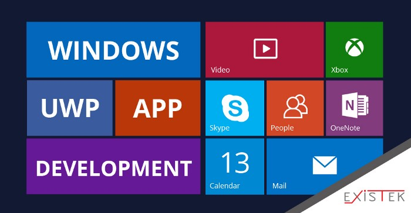

# 快捷启动Win10商店应用(UWP)的三种方式

## 一、桌面快捷方式启动（支持所有）
使用快捷键<kbd>Win</kbd>+<kbd>R</kbd>输入运行： 

```
explorer.exe shell:::{4234d49b-0245-4df3-b780-3893943456e1}
```

找到你需要的uwp应用 ➡ 右键“创建快捷方式”，就可以在桌面直接双击运行了

桌面快捷键运行：右键刚创建的快捷方式 ➡ 在快捷键栏输入快捷键 ➡ 确定


## 二、命令方式启动（支持所有）

先使用第一种方式

然后右键桌面上新建的uwp应用快捷方式 ➡ 查看属性

查看目标的值：一般为`Microsoft.应用名称_一串字符!App`（最后一点没显示一般都是!App）

然后把上面的值在前面拼接：`explorer.exe shell:AppsFolder\`

**以此类推你的应用**，最后运行命令例如：

**计算器：**

```
explorer.exe shell:AppsFolder\Microsoft.WindowsCalculator_8wekyb3d8bbwe!App
```

**Windows Terminal：**

```
explorer.exe shell:AppsFolder\Microsoft.WindowsTerminal_8wekyb3d8bbwe!App
```

> 其他查询方式：
>
> 启动PowerShell
>
> 使用命令`Get-AppxPackage`
>
> 获取所有uwp应用信息后查找，不过比较麻烦

## 三、系统内置UWP程序运行命令

使用快捷键<kbd>Win</kbd>+<kbd>R</kbd>输入运行： 

| 程序                           | 命令                      |
| :----------------------------- | :------------------------ |
| 设置                           | ms-settings:              |
| 操作中心                       | ms-actioncenter:          |
| 闹钟和时钟                     | ms-clock:                 |
| 计算器                         | calculator:               |
| 日历                           | outlookcal:               |
| 相机                           | microsoft.windows.camera: |
| 邮件                           | outlookmail:              |
| 地图                           | bingmaps:                 |
| Microsoft Edge                 | microsoft-edge:           |
| 连接                           | ms-projection:            |
| 3D Builder                     | com.microsoft.builder3d:  |
| Cortana                        | ms-cortana:               |
| Drawboard PDF                  | drawboardpdf:             |
| Facebook                       | fb:                       |
| Feedback Hub                   | feedback-hub:             |
| 获取帮助                       | ms-contact-support:       |
| Groove音乐                     | mswindowsmusic:           |
| 我的世界Windows10版            | minecraft:                |
| Xbox                           | xbox:                     |
| Xbox – 好友列表                | xbox-friendfinder:        |
| Xbox – 资料页                  | xbox-profile:             |
| Xbox – 网络设置                | xbox-network:             |
| Xbox – 设置                    | xbox-settings:            |
| Xbox One SmartGlass            | smartglass:               |
| 混合现实相机                   | ms-holocamera:            |
| 混合现实门户                   | ms-holographicfirstrun:   |
| 电影和电视                     | mswindowsvideo:           |
| 新闻                           | bingnews:                 |
| OneNote                        | onenote:                  |
| 画图3D                         | ms-paint:                 |
| 人脉                           | ms-people:                |
| Skype预览版                    | ms-projection:            |
| 商店                           | ms-windows-store:         |
| 商店-音乐                      | microsoftmusic:           |
| 商店-电影和电视                | microsoftvideo:           |
| 提示                           | ms-get-started:           |
| Twitter                        | twitter:                  |
| View 3D Preview                | com.microsoft.3dviewer:   |
| 录音机                         | ms-callrecording:         |
| 天气                           | bingweather:              |
| Windows Defender安全中心       | windowsdefender:          |
| Windows 混合现实环境           | ms-environment-builder:   |
| Windows 家长控制               | ms-wpc:                   |
| Microsoft Solitaire Collection | xboxliveapp-1297287741:   |

 

**微信搜索：RunAny**